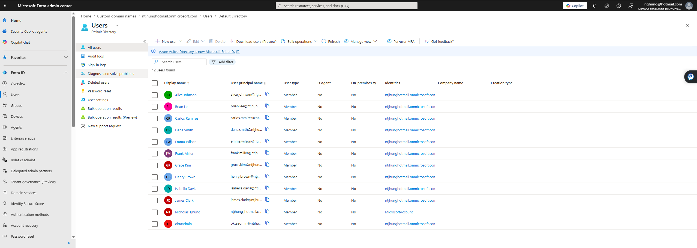
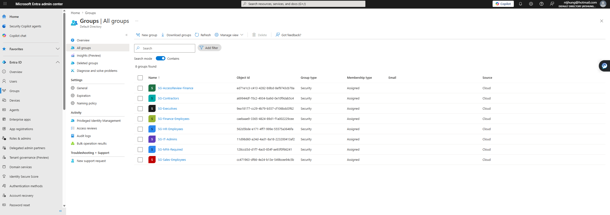
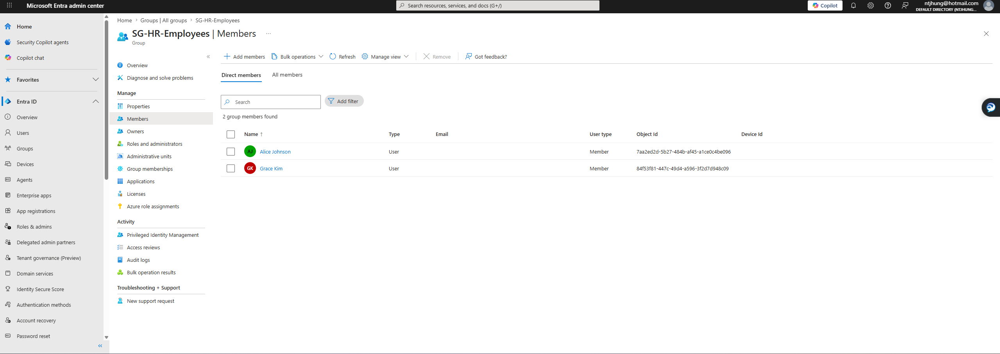
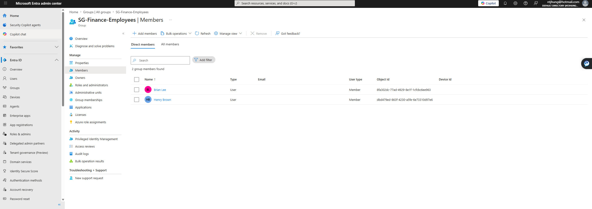
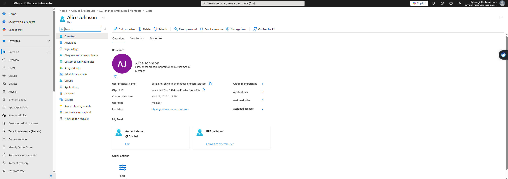

# Entra ID User Lifecycle Automation

## Project Overview

This project demonstrates a basic Identity and Access Management user lifecycle workflow using Microsoft Entra ID. The lab simulates how an organization can onboard users, assign group-based access, document access controls, and offboard users when access is no longer needed.

## Business Problem

Companies need a repeatable process for onboarding, updating, and offboarding users. Without a consistent process, users may receive incorrect access, keep access longer than needed, or create audit and security risks.

## Tools Used

- Microsoft Entra ID
- Microsoft Graph PowerShell
- PowerShell
- CSV user import
- GitHub documentation
- Markdown

## What This Project Demonstrates

- User onboarding
- Group-based access assignment
- Joiner/Mover/Leaver workflow
- User offboarding
- Access control documentation
- Audit evidence collection
- IAM runbook creation

## Lab Structure

### Departments

- IT
- HR
- Finance
- Sales
- Contractors
- Executives

### Security Groups

- SG-HR-Employees
- SG-Finance-Employees
- SG-Sales-Employees
- SG-IT-Admins
- SG-Contractors
- SG-Executives
- SG-MFA-Required
- SG-AccessReview-Finance

## Project Files

- scripts/
- sample-data/
- docs/
- screenshots/

## Scripts Created

- scripts/create-groups.ps1
- scripts/create-users.ps1
- scripts/assign-groups.ps1

## Documentation Created

- docs/Joiner-Mover-Leaver Runbook
- docs/Offboarding Checklist
- docs/Access Control Matrix
- sample-data/sample-users.csv

## Lab Screenshots

### Users Created in Microsoft Entra ID

### Security Groups Created

### HR Group Membership

### Finance Group Membership

### Example User Profile

### PowerShell Script Output Part 1

### PowerShell Script Output Part 2

## Key IAM Concepts Demonstrated

### Joiner Process

The lab simulates onboarding new users from a CSV file. Each user is created in Microsoft Entra ID and assigned department-based access.

### Group-Based Access

Users are assigned to security groups based on their department or role. This supports role-based access control and reduces manual access errors.

### Least Privilege

The access control matrix documents which departments should receive which access. This supports the principle of least privilege by limiting access to what users need for their job.

### Offboarding

The offboarding checklist documents the steps needed to disable accounts, revoke sessions, remove access, and save audit evidence.

### Audit Evidence

Screenshots and documentation were collected to show users, groups, group membership, and successful PowerShell output.

## Resume Bullet

- Built a Microsoft Entra ID user lifecycle automation lab using PowerShell and Microsoft Graph to simulate onboarding, group assignment, access removal, and audit evidence collection.

## Status

Completed initial lab build with sample users, security groups, PowerShell scripts, IAM documentation, and screenshots.
